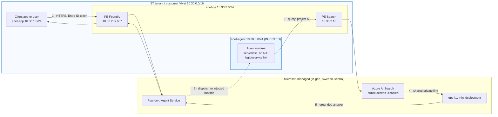
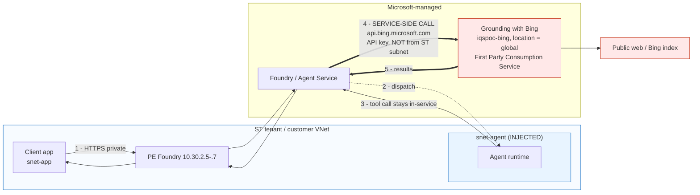

# Agent network flows — measured, not assumed

This document answers the question ST asked directly: **when an agent calls
Foundry IQ or Web IQ, where does the traffic actually go, and what can we
control?**

Everything below was measured in the POC subscription
`7771d4f4-8927-4d73-bd3d-6e6e2ed5d2aa`, resource group `rg-iqs-poc-sc`,
region Sweden Central. Reproduce with:

```bash
./scripts/10-agent-flows.sh        # inject, prove injection, run both agents
./scripts/11-nsg-enforcement.sh    # the control experiment described in §4
```

---

## 1. What "agent injection" turned out to mean

Subnet delegation is not injection. A delegated subnet is only a *reservation*.
The proof that the platform has actually claimed the subnet is a
**serviceAssociationLink**:

```
snet-agent (10.30.3.0/24)
  delegations            : Microsoft.App/environments
  serviceAssociationLinks: legionservicelink       <-- appears only after injection
  ipConfigurations       : 0
  networkInterfaces      : none
```

Two consequences ST should note:

* The agent runtime is **serverless**. There is no NIC and no IP address to
  point at in a firewall rule or a CMDB. The subnet is the only handle.
* Because there is no NIC, one might reasonably suspect that an NSG on this
  subnet is decorative. §4 shows it is not — this was tested, not assumed.

Injection was applied to an **already-existing** Foundry account with a PATCH
of `properties.networkInjections`; it is not create-time only, contrary to the
usual assumption.

---

## 2. Flow A — Agent → Foundry IQ (grounded on Azure AI Search)

Measured run: `run_Kv6htVtMAKyjgWgeS5qAaX7P`, status `completed`, tool
`azure_ai_search`, 1074 prompt / 157 completion tokens. The answer quoted a
canary string (`IQPOCPROBE-DOC-ALPHA`) that exists **only** in the private
index, so the retrieval genuinely happened.



ASCII equivalent:

```
 ST VNet 10.30.0.0/16
 ┌──────────────────────────────────────────────────────────────┐
 │ snet-app            snet-agent (INJECTED)      snet-pe        │
 │ 10.30.1.0/24        10.30.3.0/24               10.30.2.0/24   │
 │                                                               │
 │  client ──1──► PE foundry 10.30.2.5-.7 ──► Foundry/Agent Svc  │
 │                        │                                      │
 │                        └──2──► agent runtime (no NIC)         │
 │                                     │                         │
 │                                     └──3──► PE search          │
 │                                             10.30.2.10         │
 │                                                 │              │
 └─────────────────────────────────────────────────┼─────────────┘
                                                   ▼
                                    Azure AI Search (public = Disabled)
                                                   │ 4 shared private link
                                                   ▼
                                          gpt-4.1-mini deployment
```

**Every hop is private.** No leg of this flow uses a public IP address.

Controls ST holds on this flow:

| Control | Held by ST? | Evidence |
|---|---|---|
| NSG / UDR on the agent subnet | **Yes — enforced** | §4 control test |
| Private endpoint, public access disabled | Yes | `publicNetworkAccess: Disabled` |
| Entra ID auth, no API keys | Yes | claim C12, `disableLocalAuth` pinned true |
| Which index the agent may read | Yes | project connection + project-MI RBAC |
| Query text in logs | Yes, opt-in | claims C3/C4 |

> **Prerequisite that is easy to miss:** Search reaching the model requires a
> **shared private link** from the Search service to the Foundry account.
> Without it, retrieval works but any Search-side vectorisation or reranking
> against the model fails, because Search's outbound is not in ST's VNet.

---

## 3. Flow B — Agent → Web IQ (Grounding with Bing)

Measured run: `run_OCfq9N0mIoyym0lyPNKNuygS`, status `completed`, tool
`bing_grounding`, 4204 prompt / 97 completion tokens, real citation of ST's
quarterly revenue. The agent was created and run **from inside the VNet**.



ASCII equivalent — note where the trust boundary is crossed:

```
 ST VNet                                   │  Microsoft            │  Internet
 ┌──────────────────────────┐              │                       │
 │ client ──► PE foundry ────┼──────────►  Foundry / Agent Service │
 │                          │              │        ║              │
 │ snet-agent (injected)    │              │        ║ 4            │
 │   agent runtime ─────────┼──────────►   │        ▼              │
 │                          │              │  Grounding with Bing ─┼──► public web
 │   (Internet egress from  │              │  location = global    │
 │    this subnet DENIED —  │              │  outside Azure DPA    │
 │    Web IQ still worked)  │              │                       │
 └──────────────────────────┘              │                       │
```

---

## 4. The control experiment — why we can assert step 4 is service-side

Asserting "Bing is called service-side" from a diagram is worthless. It was
tested, and the test was designed so that it could have failed.

| # | Configuration on `snet-agent` | Foundry IQ agent | Web IQ agent |
|---|---|---|---|
| 1 | Baseline, unrestricted egress | `completed` | `completed` |
| 2 | `Deny * -> Internet` (Allow `AzureCloud`) | `completed` | **`completed`** |
| 3 | `Deny * -> 10.30.2.10/32` (Search PE) | **`failed`** | `completed` |

Run 3 is the control. It rules out the obvious alternative explanation — that
NSG rules on a NIC-less injected subnet are simply never programmed. They are:
denying the Search private endpoint produced

```
tool_user_error: search_access_error;
Unable to access Azure AI Search index.
```

So the NSG **is** enforced against the injected runtime. Given that, run 2 is
decisive: blocking all Internet egress from the agent subnet did **not** stop
Grounding with Bing. The Bing call therefore does not originate from ST's
network.

Verdict recorded in `out/evidence/c13-verdict.json` as
`WEB_IQ_IS_SERVICE_SIDE`.

### What this means for ST

1. **Foundry IQ is network-governable.** Retrieval traffic really does traverse
   ST's subnet, so NSGs, UDRs, forced tunnelling and a proxy all apply to it.
2. **Web IQ is not.** There is no packet to intercept, so:
   * ST **cannot** force Web IQ through a corporate proxy or inspect it;
   * ST **cannot** block it with an NSG, firewall or UDR;
   * blocking `api.bing.microsoft.com` at ST's own egress achieves nothing,
     because the call is not made from ST's egress.
3. The **only** effective controls for Web IQ are administrative:
   * do not create a `Grounding with Bing` connection on the project;
   * deny `Microsoft.Bing/accounts` creation with Azure Policy;
   * restrict who may add project connections (Azure AI Developer / owner RBAC);
   * alert on connection-creation in the Foundry account's activity log.

This is also the honest answer to **"can we add a proxy?"** — yes for Foundry IQ
egress, no for Web IQ.

---

## 5. Answering the two questions side by side

| Question | Foundry IQ | Web IQ |
|---|---|---|
| Does traffic traverse the customer VNet? | Yes (proved by control test) | **No** |
| Can an NSG/UDR/firewall control it? | Yes | No |
| Can a proxy intercept it? | Yes | No |
| Public IP anywhere in the path? | No | Yes, service-side |
| Inside the Azure DPA boundary? | Yes | **No** — First Party Consumption Service |
| Data residency | Sweden Central | `location: global` |
| Primary control surface | Network + RBAC | Connection governance + Azure Policy |

---

## 6. Reproducing this

```bash
./scripts/10-agent-flows.sh
./scripts/11-nsg-enforcement.sh
cat out/evidence/c13-verdict.json
```

`11-nsg-enforcement.sh` removes every rule it creates, so the environment is
left exactly as it was found.
